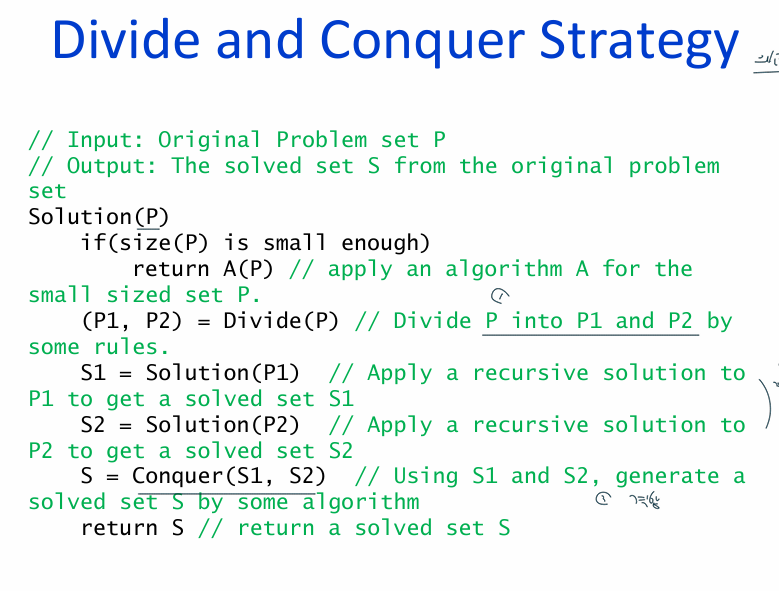
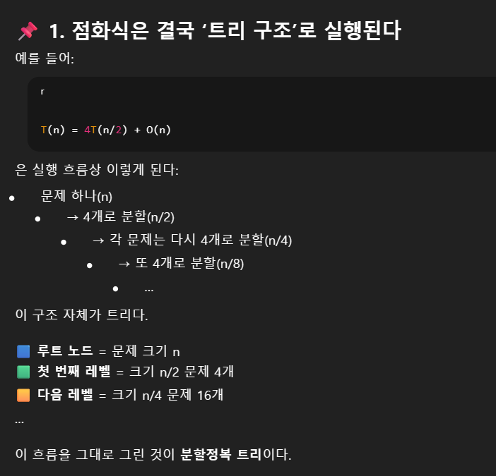

### 분할정복 (Divide and Conquer)  
1. 문제를 잘게 쪼개기  
ex. 머지 소트, 퀵 소트, 큰 숫자 곱셉
2. 작은 문제를 재귀로 해결
3. 부분 해답 -> 최종 해답

### 분할정복 구조 

### Multiplication 문제
1. Divide: 숫자를 반으로 쪼개기 
2. Conquer: 4개 부분 재귀 계싼
3. Combine

### 점화식 T(n)  

