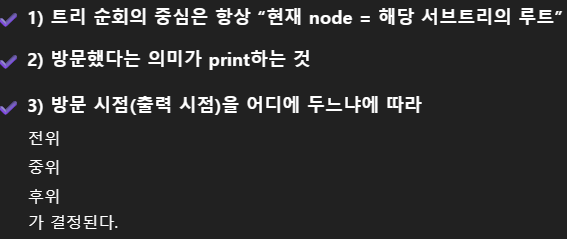

### 틀린 이유
1. 노드 생성 방식이 잘못
```declarative
aaa[0] = new Node(new Node(arr[1]), new Node(arr[2]));
// 문자 자체를 노드 객체로 만들어버리면 트리 연결이 깨진다
```
해결책
A ~ Z를 인덱스로 가지는 노드 배열을 미리 만들고 + 포인터처럼 연결 
```declarative
Node[] tree = new Node[26]; // A~Z

// 'A' = 65
char root = sc.next().charAt(0);
char left = sc.next().charAt(0);
char right = sc.next().charAt(0);

int idx = root - 'A';

// 왼쪽 자식
if (left != '.') {
    tree[idx].left = tree[left - 'A'];
}

// 오른쪽 자식
if (right != '.') {
    tree[idx].right = tree[right - 'A'];
}
```

2. 순외 함수에 root 지정
3. Node 클래스를 어떻게 만들지 여부
문제의 입력 방식, 출력 방식을 분석해서 결정.
Node 객체가 표현해야 하는 데이터: 어떤 데이터를 가지고 있어야 하는지
```declarative
// 자신(name)
// 왼쪽 자식(left)
// 오른쪽 자식(right)

class Node {
    char name;
    Node left, right;
}

```

4. 배경 지식 
순회는 **루트**를 기준으로 왼쪽 / 오른쪽 방문하는 순서를 정의
출력: 그 방문한 순서대로 노드의 이름을 적는 것 
ex. ROOT - (L - R)  전위 // ROOT가 전  


