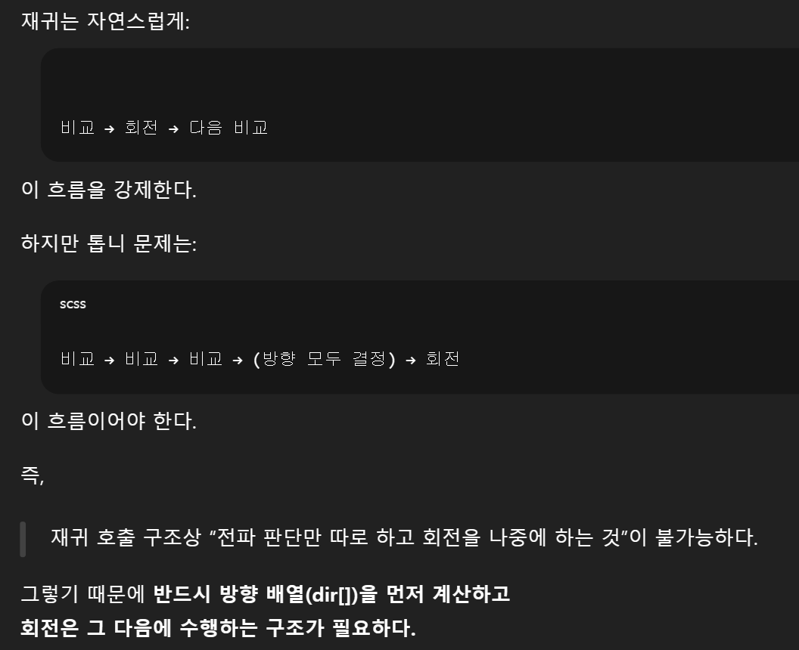

1. 재귀로 회전 결과를 반영하면서 계속 전파시키는 방식  
= 전파 방향을 모두 결정하기 전에 회전을 수행하면 안 된다.

그래서 두 step으로 나누지 못한 것
1. 회전 방향만 결정
2. 결정된 방향을 기준으로 톱니 이동 

### 재귀의 대원칙
상태를 즉시 반영 + 반영된 그 상태로 다음 호출 




전파 판단 시점 + 회전을 혼용
실제 로직 순서는
1. 비교만 하고
2. 방향만 결정하고
3. 회전은 마지막에 일괄 적용

```declarative
Iterator<T> it = dq.iterator();
it.next();   // 0
it.next();   // 1 → 오른쪽 비교용

Iterator<T> it = dq.descendingIterator();
it.next();   // 7
it.next();   // 6 → 왼쪽 비교용
```
# 문제점
### 1. 잘못된 자료형 선언
```
// 톱니바퀴 개수 4개 고정 => 고정: 배열, 가변: List
List<Deque<Integer>> arr = new ArrayList<>();

// 제네릭 배열은 안되고 실제 생성 객체는 구현체로 하기
Deque<Integer>[] gears = new ArrayDeque[4];
// Deque<Integer>[] arr = new Deque<Integer>[4];
```
### 2. Iterator 선언 방식

```declarative

```
1. remove()는 “현재 커서가 가리키는 값”을 지우는 게 아니라,
“바로 직전에 next()로 반환했던 그 값”을 지운다.
2. Iterator는 내부적으로 “방금 next()가 반환한 요소”를 기억하고 있어서,
   그 값을 변수에 저장하지 않아도 remove()로 삭제할 수 있다.
3. 핵심은 it.next() 확인하는 순간 -> 커서가 변경되는 것 

### 3. 전파 로직의 안정적 설계 
판단 -> 변경 로직 순서를 구분
이 때 판단 전 상황을 스냅샷으로 자료구조에 저장하는 것도 하나의 방법

```declarative
// 1. 톱니 4개, gear[0] ~ gear[3]
// 2. 톱니 당 8개, gear[i][0] ~ gear[i][7] 
// 3. 접점 비교, gear[i][2], gear[i][6]
int[][] gear = new int[4][8];

// 회전 구현, 시계
int temp = gear[i][7];
for(int j = 7; j > 0; j--){
    gear[i][j] = gear[i][j-1];
}
gear[i][0] = temp;
```

```declarative
// Deque + 배열 복사
// 단순 변수 + loop 조합보다 인덱스 개념이 코드 자료구조에 명시적
Deque<Integer> gear;
int[] snap = new int[8]; // 읽기 전용 배열
int idx = 0;
for(int x : gear){
    snap[idx++] = x;
}
```
### 4. 중북제거 
```declarative
BufferedReader b = new BufferedReader(new InputStreamReader(System.in));

// 입력의 단위와 Tokenizer의 생명주기는 같아야 한다
for (int i = 0; i < 4; i++){
    StringTokenizer st = new StringTokenizer(b.readLine());
    Deque<Integer> gear = new ArrayDeque<>();
    for(int j = 0; j < 8; j++){
        gear.offer(Integer.parseInt(st.nextToken()));
    }
    arr.add(gear);
}
```

```declarative
// 문제에 맞는 자료형에 대한 선택

// 문제상 몇 개가 들어오는지 모를 때
for(int i = 0; i < arr.length; i++)
for(int i = 0; i < list.size(); i++)
while(!deque.isEmpty())
for(int x : deque)

// 진짜 가변 -> iterator를 사용
Iterator<Integer> it = deque.iterator();
while(it.hasNext()){
    int x = it.next();
}


```

### 5. 문법적 오류
```declarative
now.poll().offer(); // 반환 -> Integer, Integer에는 offer x

int a = now.poll();
now.offer(a);

// 컬렉션 생성자는 -> 컬렉션만 받는다.
new ArrayList<>(); // 안에는 컬렉션만 들어가고 값 하나는 절대 못들어간다.
// new ArrayList<>(it.next());

// 값 추가 
List<Integer> t = new ArrayList<>();
t.add(it.next());

```

안에 것 생성 -> 바깥것에 추가

### 6. 설계 관점
1. 판단 -> 상태 변경 로직을 분리할 때 
판단에 필요한 값은 다 먼저 모으기, 자료구조를 활용해서  
명확성을 위해  

대원칙
1. 안에서 처리
독립적인 판단, 이전, 이후에 영향이 없고, 한 번 보고 끝날 때

2. 밖으로 자료구조를 뺴서 상태를 관리할 때
여러 객체가 서로 영향을 주고받고 판단 결과가 나중에 사용될 때  
전파, 연쇄, 누적

```declarative
//1. 배열 양옆 탐색이 하나의 for문에 가능한가?
// 이론적으로는 가능

for (int d = 1; d < 4; d++) {
    checkLeft(start - d);
    checkRight(start + d);
}

for (int l = start - 1, r = start + 1; l >= 0 || r < 4; l--, r++) {
...
}
```
```declarative
이상적 코드: 분리하기  
1. 종료 조건이 다르면 하나로 묶지 않는다.
2. 독립적인 논리는 서로 다른 제어 흐름 블록으로 분리한다.   // 독립사건, 서로 영향 x
ex. for 블록, if 블록, 함수, 배열

// 오른쪽 전파
for (int i = start; i < 3; i++) {
    if (gear[i][2] == gear[i+1][6]) break;
    rotate[i+1] = -rotate[i];
}

// 왼쪽 전파
for (int i = start; i > 0; i--) {
    if (gear[i][6] == gear[i-1][2]) break;
    rotate[i-1] = -rotate[i];
}

```
### 전후 상태 비교  
기준 상태(snapshot), 대상 상태(target)을 동시에 들고 있어야 한다.  
비교가 되려면 필요한 2가지  
1. 같은 기준에서 나온 두 값
2. 서로 다른 위치

전후 상태 비교는  
루프를 돌며 서로 다른 위치의 값을 비교하는데  
비교 중에 값 변경이 일어나면 안 되고,  
그래서 이전 상태를 미리 저장(스냅샷) 해야 한다.

그럼 연쇄 비교일때는??  
1. 비교는 기준 배열로
2. 결과는 별도의 공간에 기록하고 -> 마지막에 한 번만 적용
```declarative
int prev = snapshot[0];

for (int i = 1; i < n; i++) {
    int cur = snapshot[i];

    if (prev != cur) {
        // 로직 수행, 비교 결과 -> 바로 로직 수행
    }

    prev = cur; // 기준만 이동
}
// snapshot: 기준 배열
// 계속 비교 가능, 기준을 옮기면서 상태를 변경 x 
```
```declarative
// ex. “앞뒤가 다르면 현재 값을 0으로 바꾸고 싶다”
for (int i = 1; i < n; i++) {
    int cur = snapshot[i];

    if (prev != cur) {
    arr[i] = 0; // ❌ 즉시 적용
}

    prev = cur;
}

// 마지막에 한 번만 적용
// 1. 결과를 저장할 공간 마련
boolean[] diff = new boolean[n];

// 2. 비교만 수행
int prev = snapshot[0];

for (int i = 1; i < n; i++) {
    int cur = snapshot[i];

if (prev != cur) {
    diff[i] = true; // 결과만 기록
}

prev = cur;
}

// 3. 루프 끝나고 한 번에 적용
for (int i = 0; i < n; i++) {
    if (diff[i]) {
    arr[i] = 0; // 여기서 실제 변경
    }
}

```